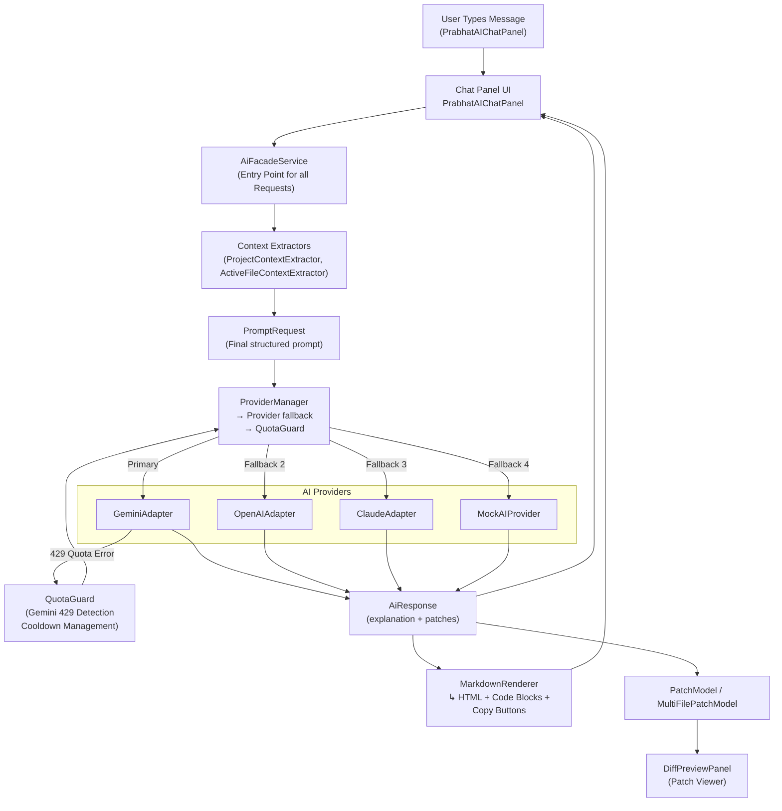
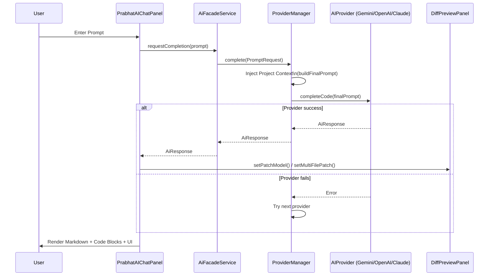
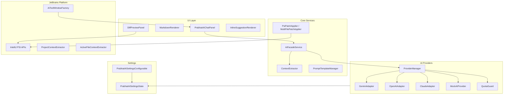
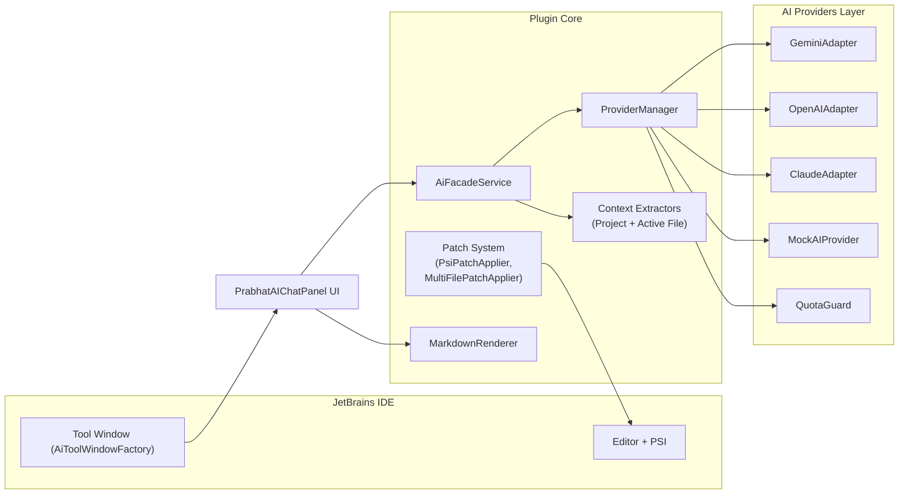
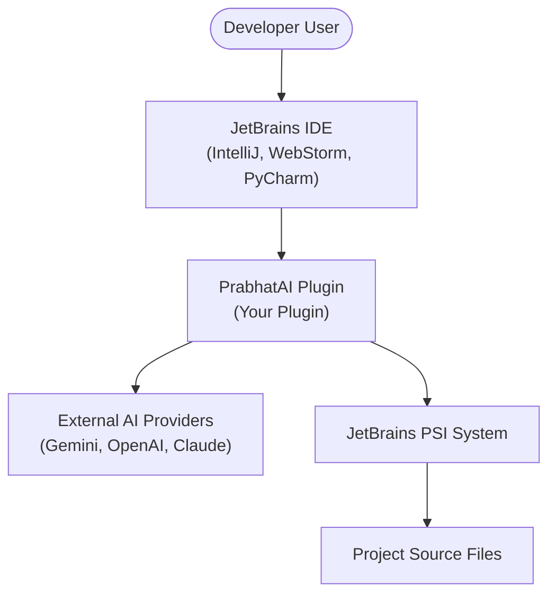

# 🚀 **PrabhatAI – AI Coding Assistant for IntelliJ IDEA**

PrabhatAI is a powerful JetBrains IntelliJ plugin that integrates multiple AI models (OpenAI, Gemini, Claude, Mock), understands your **current file**, **project structure**, and **context**, and delivers accurate, project-specific suggestions inside the IDE.

Features include:
✔ AI Chat Panel (PrabhatAIChatPanel)

✔ Code diff patch preview + auto-apply

✔ Context-aware answers using project tree + active file

✔ File-aware prompts (ProviderManager)

✔ Multi-provider fallback logic (OpenAI → Gemini → Claude → Mock)

✔ Rate-limit protection with QuotaGuard

✔ Markdown → styled HTML renderer

✔ Copy-code buttons in chat

✔ Inline suggestions (experimental)

✔ Settings UI for API keys and provider ordering

---

# 📂 **Project Structure**

```
PrabhatAI/
├── build.gradle
├── settings.gradle
├── README.md
├── gradle/
│   └── wrapper/...
├── src
│   ├── main
│   │   ├── java
│   │   │   └── com/PrabhatDevLab
│   │   │       ├── PrabhatAI.java                  # Plugin initializer
│   │   │       ├── actions
│   │   │       │   ├── ApplyPatchAction.java
│   │   │       │   └── ShowAiPanelAction.java
│   │   │       ├── listeners
│   │   │       │   └── PrabhatAIEditorListener.java
│   │   │       ├── services
│   │   │       │   ├── AiFacadeService.java
│   │   │       │   ├── ContextExtractor.java
│   │   │       │   ├── MultiFilePatchApplier.java
│   │   │       │   ├── PromptTemplateManager.java
│   │   │       │   ├── PsiPatchApplier.java
│   │   │       │   ├── ai
│   │   │       │   │   ├── AIProvider.java
│   │   │       │   │   ├── ClaudeAdapter.java
│   │   │       │   │   ├── GeminiAdapter.java
│   │   │       │   │   ├── MockAIProvider.java
│   │   │       │   │   ├── OpenAIAdapter.java
│   │   │       │   │   ├── ProviderManager.java
│   │   │       │   │   ├── QuotaGuard.java
│   │   │       │   │   └── StreamCallback.java
│   │   │       │   ├── context
│   │   │       │   │   ├── ActiveFileContextExtractor.java
│   │   │       │   │   └── ProjectContextExtractor.java
│   │   │       │   ├── models
│   │   │       │   │   ├── AiResponse.java
│   │   │       │   │   ├── MultiFilePatchModel.java
│   │   │       │   │   ├── PatchModel.java
│   │   │       │   │   └── PromptRequest.java
│   │   │       │   ├── patch
│   │   │       │   │   └── PsiPatchApplier.java
│   │   │       │   └── tests
│   │   │       │       ├── JUnitTestGenerator.java
│   │   │       │       └── TestFileCreator.java
│   │   │       ├── settings
│   │   │       │   ├── PrabhatAISettingsConfigurable.java
│   │   │       │   └── PrabhatAISettingsState.java
│   │   │       ├── ui
│   │   │       │   ├── AiToolWindowFactory.java
│   │   │       │   ├── ChatPanel.java
│   │   │       │   ├── DiffPreviewPanel.java
│   │   │       │   ├── InlineSuggestionRenderer.java
│   │   │       │   ├── MarkdownRenderer.java
│   │   │       │   └── chat/PrabhatAIChatPanel.java
│   │   │       └── util/HttpClientUtil.java
│   │   └── resources
│   │       ├── META-INF/plugin.xml
│   │       └── templates/prompt-templates.json
│   └── test
└── structure.txt
```

---

# 🧠 **How PrabhatAI Works (Internal Workflow)**

## **1. User sends a message**

`PrabhatAIChatPanel → sendMessage()`

* Adds user bubble
* Shows "Thinking…" bubble
* Calls:

```java
AiFacadeService.getInstance(project).requestCompletion(prompt)
```

---

## **2. AiFacadeService builds the final prompt**

It injects:

* Full **Project Directory Tree**
* Current Active File Content
* User Question

```java
PROJECT STRUCTURE:
<tree>

CURRENT FILE:
<open file>

USER QUESTION:
<prompt>
```

---

## **3. ProviderManager selects the first available AI provider**

Order defined in Settings:

```
Gemini → OpenAI → Claude → Mock
```

If provider fails, next one is used.

Handles:

* network errors
* invalid API key
* rate limits (QuotaGuard)
* JSON formatting issues

---

## **4. AIProvider returns an AiResponse**

AiResponse contains:

```
String explanation;          // HTML/Markdown answer
PatchModel patchModel;        // single file diff
MultiFilePatchModel multi;    // multi-file diff
```

---

## **5. PrabhatAIChatPanel renders final message**

* Removes “Thinking…”
* Formats Markdown → HTML
* Injects styling
* Renders avatars
* Makes code copyable
* Inserts AI message bubble

---

## **6. PatchPreviewPanel displays code changes**

User can apply patch → IDE modifies code safely.

---

# ⚙️ **Provider Failover Logic**

### **check 1** – Gemini

If Gemini returns HTTP 429:

```
QuotaGuard.setGeminiBlocked(60 seconds)
ProviderManager → tries next provider
ChatPanel → shows warning
```

### **check 2** – OpenAI

If OpenAI fails → fallback to Claude.

### **check 3** – Claude

If fails → fallback to Mock provider.

---

# 🌐 **API Providers & Settings**

Open:

```
Settings → Tools → PrabhatAI
```

You can configure:

* Gemini API Key
* OpenAI API Key
* Claude API Key
* Enable/disable providers
* Provider priority order
* Enable/disable mock provider

Stored in:

```
PrabhatAISettingsState.java
```

---

# 📝 **Markdown Rendering System**

File: `MarkdownRenderer.java`

Features:

* Converts Markdown → HTML
* Wraps `<pre><code>` in styled containers
* Adds “Copy” buttons automatically
* Ensures no horizontal scroll
* Dark theme compatible

---

# 💬 **Chat UI Features**

File: `PrabhatAIChatPanel.java`

* Dark theme
* Responsive chat bubbles
* Avatar icons (user + robot)
* Automatic scrolling
* No horizontal scrollbar
* Code blocks wrapped neatly
* Copy button support
* “Thinking…” placeholder bubble
* Smooth rendering

---

# 🛠️ **Build Instructions**

### **1. Install JDK 17**

JetBrains Platform requires Java 17.

### **2. Run Build**

```
./gradlew build
```

### **3. Create Plugin ZIP**

```
./gradlew buildPlugin
```

ZIP will be generated:

```
build/distributions/PrabhatAI-<version>.zip
```

---

# 📦 **Install Plugin Manually**

Inside IntelliJ:

```
Settings → Plugins → ⚙ → Install Plugin from Disk
```

Select:

```
PrabhatAI-x.y.z.zip
```

Restart IDE → Done.

---

# 🔄 **Internal Patch Workflow**

```
AI → PatchModel → DiffPreviewPanel → ApplyPatchAction → PsiPatchApplier
```

Supports:

* multi-line edits
* multi-file edits
* safe rollback
* JetBrains diff viewer

---

# 🧪 **Testing Modules**

Under `services/tests/`:

* JUnitTestGenerator.java
* TestFileCreator.java

These build files dynamically using plugin templates.

---

# 📁 **Templates**

Located at:

```
src/main/resources/templates/prompt-templates.json
```

Contains reusable prompt snippets used by ProviderManager.

---

# 🔌 **Tool Windows**

### AiToolWindowFactory

Registers your sidebar panel:

```
PrabhatAI Chat  
Patch Preview
```

---

# 💡 **Common Errors & Fixes**

### **Gemini Quota Exceeded**

Plugin will show:

```
⚠ Gemini quota exhausted. Using backup provider...
```

### **OpenAI invalid key**

ProviderManager logs & falls back silently.

### **No provider works**

Chat shows:

```
Error: No AI providers succeeded...
```

Enable Mock provider to avoid total failure.

---

# 🔧 **Development Workflow**

1. Modify code
2. Run plugin sandbox:

   ```
   ./gradlew runIde
   ```
3. Test Chat + Settings + Patch Preview
4. Build zip
5. Install and test in real IntelliJ

---


---

# ✅ **PrabhatAI Plugin — Architecture Diagram (Mermaid)**



---

# ✅ **ASCII Architecture Diagram (Good for Documentation inside IntelliJ)**

```
┌──────────────────────┐        ┌────────────────────────┐
│  User (Chat Panel)   │ -----> │ PrabhatAIChatPanel UI  │
└──────────────────────┘        └───────────┬────────────┘
                                             |
                                             v
                                 ┌────────────────────────┐
                                 │    AiFacadeService     │
                                 │  (requestCompletion)   │
                                 └───────────┬────────────┘
                                             |
                 Extracts Project Context    |
                ┌────────────────────────────┘
                v
     ┌──────────────────────────────┐
     │  Context Extractors          │
     │  - ProjectContextExtractor   │
     │  - ActiveFileContextExtractor│
     └───────────────┬──────────────┘
                     |
                     v
      ┌────────────────────────────┐
      │   PromptRequest Builder    │
      └──────────────┬────────────┘
                     |
                     v
      ┌────────────────────────────┐
      │     ProviderManager        │
      │  - tries providers         │
      │  - handles failures        │
      │  - uses QuotaGuard         │
      └──────┬──────┬──────┬──────┘
             |      |      |
   ┌─────────v──┐ ┌─v──────────┐ ┌─────────v───┐ ┌───────────v──────┐
   │ Gemini      │ │ OpenAI     │ │ Claude      │ │ Mock Provider     │
   │ Adapter     │ │ Adapter    │ │ Adapter     │ │ (fallback)        │
   └──────┬──────┘ └─────┬───────┘ └──────┬──────┘ └──────────┬──────┘
          |              |               |                     |
          | Success      | Success       | Success             | Success
          v              v               v                     v
                     ┌───────────────────────────┐
                     │        AiResponse          │
                     │ explanation + patch model  │
                     └─────────────┬─────────────┘
                                   |
                   ┌───────────────┴────────────────┐
                   v                                v
    ┌───────────────────────────┐       ┌────────────────────────────┐
    │ MarkdownRenderer (HTML)   │       │ PatchPreviewPanel (Diff)    │
    └───────────────────────────┘       └────────────────────────────┘

```

---

## ✅ **Conceptual System Overview**

### **1. UI Layer**

* PrabhatAIChatPanel
* DiffPreviewPanel
* MarkdownRenderer

### **2. Service Layer**

* AiFacadeService

  * Builds final context-aware prompt
  * Sends request to ProviderManager

### **3. Context Extraction**

* Reads:

  * Active file
  * Project structure

### **4. Provider Manager + QuotaGuard**

* Tries providers in given order
* Detects Gemini quota issues
* Automatically switches provider

### **5. Providers**

* GeminiAdapter
* OpenAIAdapter
* ClaudeAdapter
* MockAIProvider

### **6. Response Handling**

* Shows AI result
* Displays patches with built-in diff viewer

  

---

# ✅ **UML CLASS DIAGRAM (Mermaid)**

Paste directly into README:

```mermaid
classDiagram
    %% ==============================
    %% UI LAYER
    %% ==============================

    class PrabhatAIChatPanel {
        - Project project
        - JEditorPane chatPane
        - JTextArea inputArea
        - StringBuilder htmlMessages
        + sendMessage()
        + appendUserMessage()
        + appendAIMessage()
        + appendThinkingBubble()
        + removeThinkingBubble()
    }

    class ChatPanel {
    }

    class DiffPreviewPanel {
        + setPatchModel()
        + setMultiFilePatch()
    }

    class MarkdownRenderer {
        + render(markdown): String
    }

    PrabhatAIChatPanel --> MarkdownRenderer
    PrabhatAIChatPanel --> DiffPreviewPanel


    %% ==============================
    %% SERVICE FACADE
    %% ==============================

    class AiFacadeService {
        - ProviderManager manager
        + requestCompletion(prompt): CompletableFuture~AiResponse~
        + getInstance(project): AiFacadeService
    }

    PrabhatAIChatPanel --> AiFacadeService


    %% ==============================
    %% CONTEXT SYSTEM
    %% ==============================

    class ProjectContextExtractor {
        + extract(project): String
    }

    class ActiveFileContextExtractor {
        + extract(project): String
    }

    class PromptRequest {
        - String prompt
        - String context
        + getPrompt()
        + getContext()
        + setPrompt()
        + setContext()
    }

    AiFacadeService --> PromptRequest
    ProviderManager --> ProjectContextExtractor
    ProviderManager --> ActiveFileContextExtractor


    %% ==============================
    %% PROVIDER MANAGER
    %% ==============================

    class ProviderManager {
        - List~AIProvider~ providers
        - Project project
        + complete(request): CompletableFuture~AiResponse~
        + tryProvider()
        + buildFinalPrompt()
    }

    class QuotaGuard {
        + isGeminiBlocked(): boolean
        + updateLastFailure(): void
    }

    ProviderManager --> QuotaGuard


    %% ==============================
    %% AI PROVIDERS
    %% ==============================

    class AIProvider {
        <<interface>>
        + completeCode(PromptRequest): CompletableFuture~AiResponse~
        + providerId(): String
    }

    class GeminiAdapter {
        + setApiKey()
        + providerId()
        + completeCode()
    }

    class OpenAIAdapter {
        + setApiKey()
        + providerId()
        + completeCode()
    }

    class ClaudeAdapter {
        + setApiKey()
        + providerId()
        + completeCode()
    }

    class MockAIProvider {
        + providerId()
        + completeCode()
    }

    AIProvider <|.. GeminiAdapter
    AIProvider <|.. OpenAIAdapter
    AIProvider <|.. ClaudeAdapter
    AIProvider <|.. MockAIProvider

    ProviderManager --> AIProvider


    %% ==============================
    %% RESPONSE MODELS
    %% ==============================

    class AiResponse {
        - String explanation
        - PatchModel patchModel
        - MultiFilePatchModel multiFilePatchModel
        + getExplanation()
        + getPatchModel()
        + getMultiFilePatch()
    }

    class PatchModel {
        + hasChanges(): boolean
    }

    class MultiFilePatchModel {
        + hasChanges(): boolean
    }

    AiResponse --> PatchModel
    AiResponse --> MultiFilePatchModel

    PrabhatAIChatPanel --> AiResponse
```



---

## ✅ This UML shows:

### **UI Layer**

* PrabhatAIChatPanel
* MarkdownRenderer
* DiffPreviewPanel

### **Service Layer**

* AiFacadeService
* ProviderManager

### **Context Layer**

* ProjectContextExtractor
* ActiveFileContextExtractor
* PromptRequest

### **AI Provider Set**

* AIProvider (interface)
* GeminiAdapter
* OpenAIAdapter
* ClaudeAdapter
* MockAIProvider

### **Response Layer**

* AiResponse
* Patch models

### **Utility**

* QuotaGuard

Everything is properly connected with UML relationships.


---

# ## **🔥 UML Sequence Diagram — Prompt → Provider → Response → Patch**



---

# ## **🔥 UML Component Diagram — PrabhatAI Plugin**



---

# ## **🔥 JetBrains Plugin Architecture Diagram**



---

# ## **🔥 High-Level System Context Diagram (C4 Model — Level 1)**



---


# 🙌 **Contributing**

Pull requests welcome.

You can contribute:

* New AI adapters
* Better prompt engineering
* Inline suggestions model
* Chat UI themes
* Better diff rendering
* AI autocomplete (coming soon)

---

# 🏁 **License**

MIT License (recommend adding this).


